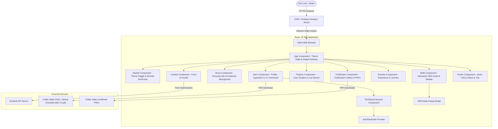
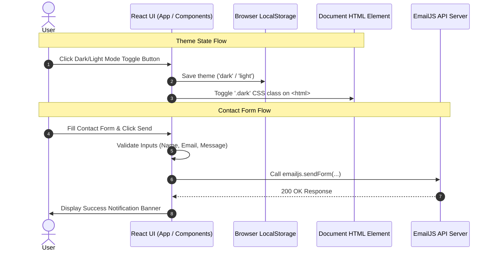

# A to Z Project Architecture Document
## Nirmal Koswatta — Portfolio Web Application

This document presents the end-to-end technical architecture, component structure, data flow, tech stack, and deployment pipeline of Nirmal Koswatta's DevOps & Full-Stack Developer Portfolio.

---

## 1. Executive Summary & Architecture Overview

* **Architectural Pattern**: Single Page Application (SPA) with Component-Driven Architecture.
* **Rendering Strategy**: Client-Side Rendering (CSR) powered by React 18 and React Scripts.
* **Styling & Design System**: Tailwind CSS v3 with Glassmorphism UI tokens, custom CSS keyframe animations, dark/light theme switching, and responsive mobile-first layouts.
* **Interactivity & Animation Engine**: Framer Motion (page transitions & scroll-triggered micro-interactions), tsParticles (canvas particle system), and React-Simple-Typewriter.
* **Integrations**: EmailJS for serverless email processing, Firebase Hosting / Vercel for continuous deployment.

---

## 2. System Architecture Diagram



---

## 3. Technology Stack Breakdown

| Layer | Technology | Purpose / Justification |
| :--- | :--- | :--- |
| **Core Framework** | React 18.2.0 | Declarative component UI library for building fast, reactive web applications. |
| **Build System** | React Scripts 5.0.1 (Webpack / Babel) | Zero-config build pipeline with production asset minification and bundling. |
| **Styling Engine** | Tailwind CSS 3.3.3 + PostCSS | Utility-first CSS framework for ultra-fast, responsive styling and glassmorphism UI. |
| **Animations** | Framer Motion 10.16.4 | Hardware-accelerated layout transitions, hover spring physics, and viewport entry effects. |
| **Particle Canvas** | tsParticles 2.12.0 / react-tsparticles | Lightweight interactive canvas background with mouse repulse effects. |
| **Scroll Observers** | `react-intersection-observer` | Triggers entry animations when components scroll into view. |
| **Icons** | Lucide React + React Icons (Simple Icons & FontAwesome) | Modern SVG icons for brand technologies, contact badges, and action buttons. |
| **Email Service** | `@emailjs/browser` | Serverless email delivery directly from client-side contact form. |
| **Hosting & CI/CD** | Firebase Hosting (`firebase.json`) & Vercel (`vercel.json`) | Global CDN edge distribution with automated SSL and single-command deployment. |

---

## 4. Directory & File Structure

```
my portfolio/
├── public/                               # Static Public Assets & PDFs
│   ├── favicon.ico / favicon.svg
│   ├── index.html                        # Main HTML Document & Meta SEO Tags
│   ├── manifest.json
│   ├── profile123.jpg                    # Profile Portrait Image
│   ├── Nirmal Koswatta ADE CV.pdf        # Main Downloadable DevOps CV
│   └── CertificateOfCompletion_*.pdf     # Certificate PDFs
│
├── src/                                  # Application Source Code
│   ├── assets/                           # Media & Static Image Assets
│   ├── components/                       # Core UI Components
│   │   ├── About.js                      # Biography, Personal Info, Education
│   │   ├── Certificates.js               # Certification Cards & Verification Modals
│   │   ├── Contact.js                    # EmailJS Contact Form & Social Badges
│   │   ├── Footer.js                     # Footer Navigation & Back-to-Top Button
│   │   ├── Hero.js                       # Hero Section, Typewriter, Primary CTAs
│   │   ├── Navbar.js                     # Dynamic Navbar, Mobile Drawer, Theme Switch
│   │   ├── Projects.js                   # Project Cards with GitHub & Live Demo Links
│   │   ├── ScrollReveal.js               # Intersection Observer Wrapper
│   │   ├── Skills.js                     # DevOps/DevSecOps/Full-Stack Skills Grid & Modals
│   │   ├── TechStackCarousel.js          # Interactive Animated Tech Stack Carousel
│   │   ├── techStackData.js              # Tech Stack Data Array & Hex Colors
│   │   └── Timeline.js                   # Work Experience Timeline (Zuse & Fortude)
│   ├── firebase.js                       # Firebase App Initialization
│   ├── index.css                         # Global CSS, Custom Utilities, Tailwind Imports
│   ├── index.js                          # React Root DOM Mount Point
│   └── App.js                            # Main App Container & Theme Provider
│
├── build/                                # Production Compiled Bundle
├── firebase.json                         # Firebase Hosting Config
├── postcss.config.js                     # PostCSS Config for Tailwind CSS
├── tailwind.config.js                    # Tailwind Theme Tokens & Extensions
├── vercel.json                           # Vercel SPA Routing & Header Config
└── package.json                          # Dependencies & NPM Scripts
```

---

## 5. Core Component Architecture & Flow

### 5.1 `App.js` (Root Container)
- **Theme Controller**: Reads `localStorage.getItem('theme')`, toggles `.dark` class on `document.documentElement`, and persists preferences.
- **Particle System**: Configures background particles via `tsParticles` (`fpsLimit: 60`, node link distance `120px`, mouse repulse mode).
- **Loading Gate**: Renders a spinning branded loader for initial mount (`1000ms`).

### 5.2 `Hero.js` (Hero & CTA)
- **Typewriter Effect**: Renders rotating headline roles (`Associate DevOps Engineer`, `Kubernetes & AWS`, `CI/CD & Cloud Infrastructure`, `Prometheus & Grafana`, `DevSecOps & Security Automation`).
- **Tech Stack Carousel Integration**: Renders infinite sliding tech badges via `TechStackCarousel`.
- **Primary & Secondary Action CTAs**:
  - `Get In Touch`: Smooth scrolls to `#contact`.
  - `Download CV`: Triggers direct download of `/Nirmal Koswatta ADE CV.pdf`.

### 5.3 `About.js` (Bio & Academic Profile)
- **Personal Info Grid**: Displays key metrics (Birthday, Location, Education: `BSc (Hons) Computer Science (UoB)`, Field: `DevOps & DevSecOps Engineering`).
- **Passions & Core Focus**: Details CI/CD automation, Terraform IaC, Prometheus/Grafana observability, SAST/DAST security scanning, and Oracle DB management.
- **Career Story**: Highlights roles at **Zuse Technologies** (Junior DevOps Engineer) and **Fortude** (Intern DevSecOps Engineer).

### 5.4 `Skills.js` (Interactive Tech Matrix)
- **DevOps & DevSecOps Skill Cards**: Highlights Grafana, Prometheus, Terraform, GitHub Actions, Coolify, Oracle DB, DevSecOps, Docker, CI/CD Pipelines, AWS Cloud, React, and Python.
- **Interactive Detail Modal**: Clicking any skill card opens a glassmorphism modal popup showcasing full skill descriptions and work experience context.
- **Learning Grid**: Displays upcoming technologies (Kubernetes, Cloud Security, Ansible, GitLab CI, Linux Admin, ArgoCD).

### 5.5 `Timeline.js` (Work Experience Journey)
- **Interactive Vertical Timeline**:
  1. **Junior DevOps Engineer @ Zuse Technologies** (`2024 - Present` | Status: `Current Role`): Infrastructure automation, Terraform IaC, Prometheus/Grafana monitoring, Oracle DB management, GitHub Actions & Coolify pipelines.
  2. **Intern DevSecOps Engineer @ Fortude** (`2024` | Status: `Completed`): CI/CD security assessments, distroless container image hardening, SAST/DAST scanner integration, and secret detection.
  3. **BSc (Hons) Computer Science Undergraduate @ University of Bedfordshire / SLIIT CityUNI** (`2023 - Present`).
  4. **Full Stack & Cloud Projects** (`2023 - Present`).
- **External Company Links**: Clickable badges opening [zuse.lk](https://zuse.lk/) and [fortude.co](https://fortude.co/) in secure new tabs.

### 5.6 `Contact.js` (Serverless Communication)
- **EmailJS Integration**: Direct browser-to-inbox form delivery using `@emailjs/browser`.
- **Validation State**: Client-side field validation, real-time error messages, and submission loading indicator.
- **Social Badges**: Quick links to GitHub, LinkedIn, Email, and Location.

---

## 6. Data & State Management



---

## 7. Build & Deployment Architecture

### 7.1 Production Build Pipeline
```bash
npm run build
```
1. **Compilation**: `react-scripts build` invokes Webpack to bundle JavaScript, SCSS/CSS, and JSX files.
2. **Optimization**: Tree-shaking, code-splitting, CSS minification (PostCSS + Autoprefixer), and SVG optimization.
3. **Artifact Generation**: Outputs optimized static assets to `build/` directory.

### 7.2 Hosting & CDN Deployment
- **Firebase Hosting Configuration (`firebase.json`)**:
  - Rewrites all SPA routes to `/index.html`.
  - Serves static assets over HTTP/2 CDN edge nodes with SSL encryption.
- **Vercel Configuration (`vercel.json`)**:
  - Sets up routing rewrites and static header caching rules.

---

## 8. Performance & Security Best Practices

1. **Asset Compression & Caching**: All static PDF assets and images are optimized for production delivery.
2. **Secure External Links**: All outward hyper-references (e.g. [zuse.lk](https://zuse.lk/), [fortude.co](https://fortude.co/), GitHub, LinkedIn) enforce `target="_blank" rel="noopener noreferrer"` to prevent window opener hijacking vulnerabilities.
3. **Responsive Frame Rate Management**: Particle canvas animations run with capped `fpsLimit: 60` to ensure low CPU/GPU footprint across mobile and low-power devices.
4. **Theme Preference Persistence**: Prevents UI flash of unstyled content (FOUC) by checking theme settings immediately on DOM load.

---
*Generated for Nirmal Koswatta — Portfolio Technical Architecture Specifications.*
